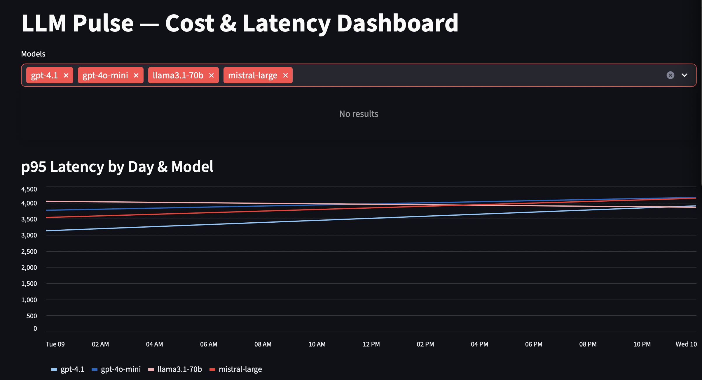

# LLM Pulse

Local LLM telemetry pipeline: **Redpanda (Kafka) → MinIO (S3) → DuckDB → Streamlit**.  
You can generate synthetic events, land them in S3 (Bronze), transform to Silver/Gold with DuckDB, and explore them in a Streamlit dashboard.

This README will be built step-by-step. Next we’ll add architecture, prerequisites, and exact run commands.
## ✅ Prerequisites

- **Docker Desktop** (for Redpanda & MinIO)
- **Python 3.10+** with `pip`
- **macOS/Linux** (Windows works with **WSL2**)
- **Resources**: ≥ 8 GB RAM free, ≥ 10 GB disk
- **Open ports** on your machine:
  - MinIO: `9000` (API), `9001` (Console)
  - Redpanda: `9092` (Kafka), `9644` (Admin API), `8080/8081/8082` (Console)
  - Streamlit: `8502` (Dashboard)
- **Command-line tools**: `git`, `curl`, `bash`, `docker`, `docker compose`

> If any port above is already in use, stop the conflicting service or change the port in `docker-compose.yml`.
## 🚀 Quickstart

### 1) Start the infrastructure
```bash
docker compose up -d

This brings up:
- **Redpanda (Kafka)** on `9092`
- **Redpanda Console** on `8080/8081/8082`
- **Redpanda Admin** on `9644`
- **MinIO API** on `9000`
- **MinIO Console** on `9001` (login: `minioadmin/minioadmin`)
### 2) Generate demo events

```bash
# If your venv isn’t active yet:
source .venv/bin/activate

# Send ~90 prompt/response pairs into Kafka
python services/event_gen/event_gen.py \
  --eps 3 \
  --seconds 30 \
  --brokers localhost:9092

This publishes synthetic LLM prompts/responses to the Kafka topics
llm.prompts and llm.responses.
### 3) Ingest Kafka to MinIO (Bronze)

```bash
# MinIO defaults (change if you customized them)
export MINIO_ENDPOINT=http://localhost:9000
export MINIO_KEY=minioadmin
export MINIO_SECRET=minioadmin
export LP_BUCKET=llm-pulse

# Read from Kafka and write Parquet files to s3://llm-pulse/bronze/...
python services/ingest/ingest.py \
  --brokers localhost:9092 \
  --endpoint $MINIO_ENDPOINT \
  --bucket $LP_BUCKET
You should see lines like “connected to localhost:9092” and “wrote XX prompts/responses records”.
Open MinIO Console at http://localhost:9001 (login: minioadmin/minioadmin) to verify files under
s3://llm-pulse/bronze/....
### 4) Transform Bronze → Silver/Gold with DuckDB

This step reads the raw **Bronze** parquet files from MinIO and writes cleaned **Silver** datasets
plus an aggregated **Gold** table used by the dashboard.

```bash
# Uses the same env as Step 3 (override if you changed them)
export MINIO_ENDPOINT=${MINIO_ENDPOINT:-http://localhost:9000}
export MINIO_KEY=${MINIO_KEY:-minioadmin}
export MINIO_SECRET=${MINIO_SECRET:-minioadmin}
export LP_BUCKET=${LP_BUCKET:-llm-pulse}

# Run the DuckDB transform
python analytics/transform_duckdb.py
Outputs (visible in the MinIO console at http://localhost:9001):
s3://llm-pulse/silver/prompts/*.parquet
s3://llm-pulse/silver/responses/*.parquet
s3://llm-pulse/gold/model_daily/day=*/*.parquet ← used by the dashboard(Optional quick check)
duckdb -c "SELECT day, model, SUM(total_cost_usd) AS cost
FROM read_parquet('s3://llm-pulse/gold/model_daily/**/*.parquet')
GROUP BY 1,2 ORDER BY 1,2;"
### 5) Launch the Streamlit Dashboard

The dashboard reads the **Gold** table from MinIO and visualizes daily model cost & p95 latency.

```bash
# Reuse env (override if needed)
export MINIO_ENDPOINT=${MINIO_ENDPOINT:-http://localhost:9000}
export MINIO_KEY=${MINIO_KEY:-minioadmin}
export MINIO_SECRET=${MINIO_SECRET:-minioadmin}
export LP_BUCKET=${LP_BUCKET:-llm-pulse}

# Choose a port (change if 8502 is busy)
export PORT=${PORT:-8502}

# Start Streamlit with the project venv
./.venv/bin/python -m streamlit run dashboard/app.py --server.port "$PORT"
Open: http://localhost:$PORT
Pick a date range (use the last 1–2 days if you just generated events).
Filter by model with the “Models” multiselect.
Stop: press Ctrl + C.
Troubleshooting

ModuleNotFoundError: duckdb → source .venv/bin/activate && pip install -r requirements.txt
Port already in use → set a different PORT value, e.g. PORT=8503.
Empty charts → make sure Steps 2–4 ran and the gold/model_daily/... parquet exists in MinIO.
### 6) One-command end-to-end (optional)

If you created `scripts/run_all.sh`, you can run the whole pipeline in one go:

```bash
# Defaults: EPS=3 SECONDS_RUN=30 PORT=8502
bash scripts/run_all.sh
Override at run time:
EPS=5 SECONDS_RUN=20 PORT=8503 bash scripts/run_all.sh
What it does:
Generates synthetic events to Kafka (Redpanda).
Ingests to S3 (MinIO) as Bronze parquet.
Transforms Bronze → Silver/Gold with DuckDB and writes to MinIO.
Launches the Streamlit dashboard on $PORT.
Stop Streamlit with Ctrl + C.
To stop the containers:
docker compose down
## 🧹 Teardown & Cleanup

Stop the dashboard (Ctrl + C in the Streamlit terminal).

Stop containers:
```bash
docker compose down
Remove containers + volumes (wipes MinIO data):
docker compose down -v
If you want to delete your local virtualenv:
rm -rf .venv

## 📸 Dashboard preview



## 🚀 Try the dashboard (demo mode — no Kafka/MinIO needed)

You can preview the dashboard using the bundled sample file `demo_data/gold_sample.parquet`.

```bash
python3 -m venv .venv && source .venv/bin/activate
pip install -U pip -r requirements.txt
STREAMLIT_SERVER_PORT=8502 streamlit run dashboard/app.py
The app will prefer the local demo_data/gold_sample.parquet.
If your MinIO is up and credentials are set, it will read the live Gold as well.
